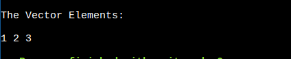

# ModernCpp
## 1.**STL (Standard Template Library) in C++**

The **Standard Template Library (STL)** is a powerful library in C++ that provides **generic and reusable components** such as containers, algorithms, iterators, and functions. It enables efficient programming by offering **ready-made data structures** and **algorithms**.

------

## **🛠 Components of STL**

STL is divided into **four main components:**

| Component                         | Description                                                  |
| --------------------------------- | ------------------------------------------------------------ |
| **1️⃣ Containers**                  | Predefined data structures like vectors, lists, maps, and sets |
| **2️⃣ Algorithms**                  | Functions for sorting, searching, and modifying data         |
| **3️⃣ Iterators**                   | Objects that allow traversal through containers              |
| **4️⃣ Function Objects (Functors)** | Special functions that behave like objects                   |

------

## **1️⃣ STL Containers** (Data Structures)

Containers are **pre-built data structures** used to store and manage data.

| Type                       | Containers                                                   | Description                       |
| -------------------------- | ------------------------------------------------------------ | --------------------------------- |
| **Sequence Containers**    | `vector`, `array`, `list`, `deque`, `forward_list`           | Store elements in a linear order  |
| **Associative Containers** | `set`, `map`, `unordered_set`, `unordered_map`, `multiset`, `multimap` | Store key-value pairs efficiently |
| **Container Adapters**     | `stack`, `queue`, `priority_queue`                           | Modify container behavior         |

✔ **Example - Using `vector`:**

```c++
#include <iostream>
#include <vector>

int main() {
    std::vector<int> v = {1, 2, 3}; 
    v.push_back(4); // Add element

    for (int num : v)
        std::cout << num << " "; // Output: 1 2 3 4
}
```

------

## **2️⃣ STL Algorithms** (Operations on Containers)

STL provides **predefined algorithms** for **sorting, searching, modifying**, etc.

✔ **Example - Sorting and Finding Elements:**

```c++
#include <iostream>
#include <vector>
#include <algorithm>

int main() {
    std::vector<int> v = {3, 1, 4, 2};

    std::sort(v.begin(), v.end()); // Sort elements
    std::cout << "Sorted: ";
    for (int num : v) std::cout << num << " "; // Output: 1 2 3 4

    if (std::binary_search(v.begin(), v.end(), 3)) 
        std::cout << "\nFound 3!";
}
```

📌 **Popular Algorithms in STL:**

| Algorithm                  | Description              |
| -------------------------- | ------------------------ |
| `sort(begin, end)`         | Sort elements            |
| `reverse(begin, end)`      | Reverse a range          |
| `find(begin, end, value)`  | Search for a value       |
| `count(begin, end, value)` | Count occurrences        |
| `min_element(begin, end)`  | Find the minimum element |
| `max_element(begin, end)`  | Find the maximum element |

------

## **3️⃣ STL Iterators** (Traversal Mechanism)

Iterators are **pointers** that allow **sequential access** to elements in containers.

✔ **Example - Using Iterators:**

```c++
#include <iostream>
#include <vector>

int main() {
    std::vector<int> v = {10, 20, 30};
    
    std::vector<int>::iterator it; // Declare iterator
    for (it = v.begin(); it != v.end(); ++it)
        std::cout << *it << " "; // Output: 10 20 30
}
```

📌 **Types of Iterators:**

| Iterator Type              | Description                  | Example Containers         |
| -------------------------- | ---------------------------- | -------------------------- |
| **Input Iterator**         | Read elements **once**       | `istream_iterator`         |
| **Output Iterator**        | Write elements **once**      | `ostream_iterator`         |
| **Forward Iterator**       | Traverse forward             | `forward_list`             |
| **Bidirectional Iterator** | Traverse forward & backward  | `list`, `set`, `map`       |
| **Random Access Iterator** | Access elements **randomly** | `vector`, `deque`, `array` |

------

## **4️⃣ Function Objects (Functors)**

A **functor** is a class with an overloaded `operator()`, making it behave like a function.

✔ **Example - Using a Functor:**

```c++
#include <iostream>
#include <algorithm>
#include <vector>

struct MultiplyByTwo {
    void operator()(int &n) { n *= 2; }
};

int main() {
    std::vector<int> v = {1, 2, 3};
    std::for_each(v.begin(), v.end(), MultiplyByTwo()); 

    for (int num : v) std::cout << num << " "; // Output: 2 4 6
}
```

📌 **Uses of Functors:**

- Custom sorting
- Modifying elements
- Predicate functions (used with `remove_if`, `find_if`, etc.)

------

## **🚀 Why Use STL?**

✅ **Saves Time** – No need to implement common data structures manually.
✅ **Efficient & Optimized** – STL is well-tested for performance.
✅ **Portable & Reusable** – Works across different platforms.
✅ **Generic & Flexible** – Uses templates to work with any data type.

------

## **🎯 Summary**

| STL Component  | Purpose             | Example                                         |
| -------------- | ------------------- | ----------------------------------------------- |
| **Containers** | Store elements      | `vector<int> v = {1, 2, 3};`                    |
| **Algorithms** | Process elements    | `std::sort(v.begin(), v.end());`                |
| **Iterators**  | Traverse containers | `std::vector<int>::iterator it = v.begin();`    |
| **Functors**   | Act like functions  | `struct Multiply { void operator()(int &n); };` |

-------------------

-----------------


### 1. For-ranged

The range-based `for` loop, introduced in C++11, provides a more concise and readable way to iterate over elements in a container (like arrays, vectors, lists, etc.) or any range-supporting object. It simplifies the syntax compared to the traditional `for` loop and reduces the potential for errors.

### Basic Syntax

The range-based `for` loop has the following syntax:

```c++
for (declaration : range) {
    // loop body
}
```

- **`declaration`**: This is the type and variable name that will take on the value of each element in the range during each iteration.
- **`range`**: This is the container or range to iterate over.

### Example with a Standard Library Container

Here is an example using a `std::vector`:

```c++
#include <iostream>
#include <vector>

int main() {
    std::vector<int> numbers = {1, 2, 3, 4, 5};

    // Range-based for loop
    for (int num : numbers) {
        std::cout << num << " ";
    }
    std::cout << std::endl;

    return 0;
}
```

>When you use a range-based for loop without a reference (`int num` instead of `int& num`), the loop variable (`num`) **receives a copy** of each element in the container. This means any modifications made inside the loop affect **only the copy**, not the original container.

### Using References

If you need to modify the elements of the container, you should use a reference in the declaration:

```c++
#include <iostream>
#include <vector>

int main() {
    std::vector<int> numbers = {1, 2, 3, 4, 5};

    // Modify elements using a reference
    for (int& num : numbers) {
        num *= 2;
    }

    for (int num : numbers) {
        std::cout << num << " ";
    }
    std::cout << std::endl;

    return 0;
}
```

### Using `const` References

If you are not modifying the elements and want to avoid copying them, you can use `const` references:

```c++
#include <iostream>
#include <vector>

int main() {
    std::vector<int> numbers = {1, 2, 3, 4, 5};

    // Use const reference to avoid copying elements
    for (const int& num : numbers) {
        std::cout << num << " ";
    }
    std::cout << std::endl;

    return 0;
}
```

### Range-Based `for` Loop with Arrays

The range-based `for` loop also works with arrays:

```c++
#include <iostream>

int main() {
    int arr[] = {1, 2, 3, 4, 5};

    for (int num : arr) {
        std::cout << num << " ";
    }
    std::cout << std::endl;

    return 0;
}
```

### Range-Based `for` Loop with Initializer Lists

You can also use range-based `for` loops with initializer lists:

```c++
#include <iostream>

int main() {
    for (int num : {1, 2, 3, 4, 5}) {
        std::cout << num << " ";
    }
    std::cout << std::endl;

    return 0;
}
```

### Custom Iterators

Range-based `for` loops work with any class that has `begin()` and `end()` member functions returning iterators, which includes all standard library containers.

### Summary

The range-based `for` loop simplifies iterating over elements in a container, improving code readability and reducing the potential for errors. Here’s a summary example combining various use cases:

```c++
#include <iostream>
#include <vector>
#include <list>
#include <string>

int main() {
    std::vector<int> vec = {1, 2, 3, 4, 5};
    std::list<std::string> strList = {"Hello", "World", "C++"};
    int arr[] = {10, 20, 30, 40, 50};

    // Vector
    for (int num : vec) {
        std::cout << num << " ";
    }
    std::cout << std::endl;

    // List with const reference
    for (const std::string& str : strList) {
        std::cout << str << " ";
    }
    std::cout << std::endl;

    // Array
    for (int num : arr) {
        std::cout << num << " ";
    }
    std::cout << std::endl;

    // Initializer list
    for (int num : {100, 200, 300}) {
        std::cout << num << " ";
    }
    std::cout << std::endl;

    return 0;
}
```


--------------------

---------------------------------------

## 2. Array in Modern C++

In modern C++ (specifically starting from C++11), the Standard Library introduced `std::array`, a fixed-size sequence container that provides a more consistent interface with other Standard Library containers compared to built-in arrays. `std::array` is defined in the `<array>` header.

Here is an overview of the member functions listed in your image, with examples and explanations:

### 1. `array::at`

The `at` member function provides bounds-checked access to elements.

```c++
#include <iostream>
#include <array>

int main() {
    std::array<int, 5> arr = {1, 2, 3, 4, 5};
    std::cout << "Element at index 2: " << arr.at(2) << std::endl;  // Output: 3

    // Uncommenting the next line will throw an out-of-range exception
    // std::cout << arr.at(5) << std::endl;
}
```

### 2. `array::back`

The `back` member function returns a reference to the last element.

```c++
#include <iostream>
#include <array>

int main() {
    std::array<int, 5> arr = {1, 2, 3, 4, 5};
    std::cout << "Last element: " << arr.back() << std::endl;  // Output: 5
}
```

### 3. `array::begin` and `array::end`

`begin` returns an iterator to the first element, and `end` returns an iterator to one past the last element.

```c++
#include <iostream>
#include <array>

int main() {
    std::array<int, 5> arr = {1, 2, 3, 4, 5};
    for (auto it = arr.begin(); it != arr.end(); ++it) {
        std::cout << *it << ' ';
    }
    // Output: 1 2 3 4 5
}
```

>```c++
>#include <iostream>
>#include <vector>
>
>int main() {
>    std::vector<int> vec = {10, 20, 30};
>    std::cout << *vec.end()<<std::endl;  
>}
>```
>
>```c++
>g++ -D_GLIBCXX_DEBUG examples.cc -o app
>```
>
>### **`-D_GLIBCXX_DEBUG` in C++ (GCC Debug Mode)**
>
>`_GLIBCXX_DEBUG` stands for **"GNU LIBC++ eXtension Debug"**, which is part of the **GNU Standard C++ Library (libstdc++)** used in GCC.
>
>- **`GLIBCXX`** → Refers to **GNU's implementation of the C++ Standard Library** (`libstdc++`).
>- **`DEBUG`** → Enables **debugging features** for STL containers and iterators.
>
>------------------------
>
>-------------------------
>
>`-D_GLIBCXX_DEBUG` is a **preprocessor macro** that enables **extra runtime checks** for **Standard Template Library (STL) containers** when compiling with GCC.
>
>It helps **catch common mistakes** like:
>
>- **Dereferencing invalid iterators**
>- **Out-of-bounds access**
>- **Modifying containers while iterating**
>- **Iterator mismatches (e.g., comparing iterators from different containers)**


### 4. `array::cbegin` and `array::cend`

`cbegin` returns a constant iterator to the first element, and `cend` returns a constant iterator to one past the last element.

```c++
#include <iostream>
#include <array>

int main() {
    std::array<int, 5> arr = {1, 2, 3, 4, 5};
    for (auto it = arr.cbegin(); it != arr.cend(); ++it) {
        std::cout << *it << ' ';
    }
    // Output: 1 2 3 4 5
}
```


>**Difference Between `cbegin()` and `begin()` in C++ STL** :
>
>Both `begin()` and `cbegin()` are **member functions** used to get an iterator to the first element of a container, but they have a key difference:
>
>| Function       | Return Type      | Mutability                               |
>| -------------- | ---------------- | ---------------------------------------- |
>| **`begin()`**  | `iterator`       | ✅ **Allows modification**                |
>| **`cbegin()`** | `const_iterator` | ❌ **Read-only (cannot modify elements)** |
>
>------
>
>### **📌 `begin()` - Returns a Mutable Iterator**
>
>- Allows **modifying** the elements of the container.
>- Returns an **iterator** of type `std::array<int, 5>::iterator`.
>
>✔ **Example: Using `begin()` to Modify Elements**
>
>```c++
>#include <iostream>
>#include <array>
>
>int main() {
>    std::array<int, 5> arr = {1, 2, 3, 4, 5};
>
>    for (auto it = arr.begin(); it != arr.end(); ++it) {
>        *it *= 2;  // ✅ Allowed (modifies elements)
>    }
>
>    for (int num : arr) {
>        std::cout << num << ' ';  // Output: 2 4 6 8 10
>    }
>}
>```
>
>------
>
>### **📌 `cbegin()` - Returns a Constant Iterator**
>
>- **Prevents modification** of elements.
>- Returns an **iterator** of type `std::array<int, 5>::const_iterator`.
>- Useful when you want to ensure **read-only access** to elements.
>
>✔ **Example: Using `cbegin()` (Read-Only)**
>
>```
>#include <iostream>
>#include <array>
>
>int main() {
>    std::array<int, 5> arr = {1, 2, 3, 4, 5};
>
>    for (auto it = arr.cbegin(); it != arr.cend(); ++it) {
>        std::cout << *it << ' ';  // ✅ Allowed (only reading)
>        // *it *= 2; ❌ ERROR: Cannot modify read-only elements
>    }
>}
>```
>
>🔹 Output: `1 2 3 4 5`
>
>------
>
>## **🛠 When to Use `cbegin()` vs `begin()`?**
>
>| Use Case                                   | Which One to Use? |
>| ------------------------------------------ | ----------------- |
>| Need to modify elements                    | ✅ Use `begin()`   |
>| Only need to read elements (ensure safety) | ✅ Use `cbegin()`  |
>
>


### 5. `array::crbegin` and `array::crend`

`crbegin` returns a constant reverse iterator to the last element, and `crend` returns a constant reverse iterator to one before the first element.

```c++
#include <iostream>
#include <array>

int main() {
    std::array<int, 5> arr = {1, 2, 3, 4, 5};
    for (auto it = arr.crbegin(); it != arr.crend(); ++it) {
        std::cout << *it << ' ';
    }
    // Output: 5 4 3 2 1
}
```

>```c++
>#include <iostream>
>#include <vector>
>
>int main() {
>    std::vector<int> vec = {10, 20, 30, 40, 50};
>
>    auto rit = vec.crbegin(); // ✅ Points to the last element (50)
>    std::cout << "Last element: " << *rit << std::endl; // Output: 50
>
>    auto rend = vec.crend();   // ❌ Points before the first element (out of bounds)
>    // std::cout << *rend;     // 🚨 Undefined Behavior! Do NOT dereference rend!
>
>    return 0;
>}
>
>```
>
>- Without `_GLIBCXX_DEBUG`, this may still **compile and run**, but it can return **garbage values** or **cause a segmentation fault**.
>
>- **With `_GLIBCXX_DEBUG` enabled**, the debug library detects the issue and **aborts execution** with an error.


### 6. `array::data`

`data` returns a pointer to the underlying array.

```c++
#include <iostream>
#include <array>

int main() {
    std::array<int, 5> arr = {1, 2, 3, 4, 5};
    int* ptr = arr.data();
    std::cout << "First element via pointer: " << *ptr << std::endl;  // Output: 1
}
```

### 7. `array::empty`

`empty` checks whether the array is empty (always returns false for `std::array` since its size is fixed).

```c++
#include <iostream>
#include <array>

int main() {
    std::array<int, 5> arr = {1, 2, 3, 4, 5};
    std::cout << "Is the array empty? " << std::boolalpha << arr.empty() << std::endl;  // Output: false
}
```

### 8. `array::fill`

`fill` assigns the specified value to all elements.

```c++
#include <iostream>
#include <array>

int main() {
    std::array<int, 5> arr;
    arr.fill(10);
    for (const auto& elem : arr) {
        std::cout << elem << ' ';
    }
    // Output: 10 10 10 10 10
}
```

### 9. `array::front`

`front` returns a reference to the first element.

```c++
#include <iostream>
#include <array>

int main() {
    std::array<int, 5> arr = {1, 2, 3, 4, 5};
    std::cout << "First element: " << arr.front() << std::endl;  // Output: 1
}
```

### 10. `array::max_size`

`max_size` returns the maximum number of elements the array can hold (always returns the size of the array).

```c++
#include <iostream>
#include <array>

int main() {
    std::array<int, 5> arr;
    std::cout << "Maximum size: " << arr.max_size() << std::endl;  // Output: 5
}
```

### 11. `array::operator[]`

The subscript operator provides unchecked access to elements.

```c++
#include <iostream>
#include <array>

int main() {
    std::array<int, 5> arr = {1, 2, 3, 4, 5};
    std::cout << "Element at index 2: " << arr[2] << std::endl;  // Output: 3
}
```

### 12. `array::rbegin` and `array::rend`

`rbegin` returns a reverse iterator to the last element, and `rend` returns a reverse iterator to one before the first element.

```c++
#include <iostream>
#include <array>

int main() {
    std::array<int, 5> arr = {1, 2, 3, 4, 5};
    for (auto it = arr.rbegin(); it != arr.rend(); ++it) {
        std::cout << *it << ' ';
    }
    // Output: 5 4 3 2 1
}
```

### 13. `array::size`

`size` returns the number of elements in the array.

```c++
#include <iostream>
#include <array>

int main() {
    std::array<int, 5> arr = {1, 2, 3, 4, 5};
    std::cout << "Size of the array: " << arr.size() << std::endl;  // Output: 5
}
```

### 14. `array::swap`

`swap` exchanges the contents of the array with another array of the same type and size.

```c++
#include <iostream>
#include <array>

int main() {
    std::array<int, 5> arr1 = {1, 2, 3, 4, 5};
    std::array<int, 5> arr2 = {6, 7, 8, 9, 10};
    arr1.swap(arr2);

    std::cout << "Contents of arr1: ";
    for (const auto& elem : arr1) {
        std::cout << elem << ' ';
    }
    std::cout << std::endl;  // Output: 6 7 8 9 10

    std::cout << "Contents of arr2: ";
    for (const auto& elem : arr2) {
        std::cout << elem << ' ';
    }
    std::cout << std::endl;  // Output: 1 2 3 4 5
}
```


## 3. Vector in Modern C++

In modern C++ (starting from C++11), the `std::vector` class template is one of the most commonly used sequence containers, providing dynamic array functionality. Vectors manage their own memory and can change size dynamically, which makes them very flexible. They are defined in the `<vector>` header.

Here is an overview of the member functions listed in your image, with examples and explanations:

### 1. `vector::assign`

**1.1. Initializing Vector by Pushing values One by One**

```c++
vector_name.push_back(value_to_be_pushed_at_end_of_vector)
```

Vector can be initialized by pushing value one by one. This method involves creating an empty vector and adding elements to it one by one using the **push_back()** function.

```c++
#include <iostream>
#include <vector>

int main()
{
    // Create an empty vector
   std::vector<int> vector_1;
	std::cout<<"\nThe Vector Elements: \n\n";
    vector_1.push_back(1);
    vector_1.push_back(2);
    vector_1.push_back(3);

    for (int x : vector_1)
        std::cout << x << " ";

    return 0;
}
```



**1.2. Initializing Vector by Specifying Size and Initializing All Elements by the same value **

```c++
vector<data_type> vector_name(vector_size, default_value_for_all_elements);
```


```c++
#include <iostream>
#include <vector>

int main() {
    std::vector<int> vec;
    vec.assign(5, 10);  // Assigns 5 elements with the value 10
    for (const auto& elem : vec) {
        std::cout << elem << ' ';
    }
    // Output: 10 10 10 10 10
}
```


>```c++
>#include <iostream>
>#include <vector>
>```
>
>- **`#include <iostream>`**: Includes the standard input-output stream library to use `std::cout` for printing to the console.
>- **`#include <vector>`**: Includes the vector library to use the `std::vector` container.
>
>#### Main Function
>
>```c++
>int main() {
>   std::vector<int> vec;
>   vec.assign(5, 10);  // Assigns 5 elements with the value 10
>   for (const auto& elem : vec) {
>       std::cout << elem << ' ';
>   }
>   // Output: 10 10 10 10 10
>}
>```
>
>#### Vector Declaration
>
>```c++
>std::vector<int> vec;
>```
>
>- **Vector Initialization**: Declares a vector named `vec` of type `int`. Initially, this vector is empty.
>
>#### Vector Assignment
>
>```c++
>vec.assign(5, 10);  // Assigns 5 elements with the value 10
>```
>
>- The `assign` method is used to assign new values to the vector.
> - **First Parameter (5)**: Specifies the number of elements to assign.
> - **Second Parameter (10)**: Specifies the value to assign to each element.
>- **Result**: The vector `vec` now contains 5 elements, each with the value 10. So, `vec` becomes `[10, 10, 10, 10, 10]`.
>
>#### Loop and Printing
>
>```c++
>for (const auto& elem : vec) {
>   std::cout << elem << ' ';
>}
>```
>
>- **Range-Based For Loop **: Iterates over each element in the vector `vec`
> - **`const auto& elem`**: Declares a constant reference to each element in the vector, allowing the loop to access each element without copying it.
>- **Printing Each Element**: Inside the loop, `std::cout << elem << ' ';` prints each element followed by a space.
>- **Output**: The elements of the vector are printed sequentially. For this vector, the output is `10 10 10 10 10`.
>
>The code demonstrates the following:
>
>1. **Vector Initialization**: An empty vector `vec` of type `int` is created.
>2. **Vector Assignment**: The `assign` method is used to assign 5 elements, each with the value 10, to the vector.
>3. **Range-Based For Loop**: Iterates over the elements of the vector and prints each one, resulting in the output `10 10 10 10 10`.
>
>

**1.3.   Initialize the vector like the array **

```c++
vector<data_type> vector_name={item0,item1,item2.....}
```

```c++
#include <iostream>
#include <vector>
int main()
{
    std::vector<int> vect={ 1, 2, 3 ,4 };
    /* OR use this , the same output and effect.
		std::vector<int> vect{ 1, 2, 3 };
	*/
    for (int x : vect)
    {
     	std::cout << x << " ";   
    }
    return 0;
}
```


**1.4. Initialize vector by Array**

```c++
vector<data_type> vector_name(array, array + size);
```

```c++
#include <iostream>
#include <vector>

int main()
{
    int array[] = { 1, 2, 3, 4 };
    int size = sizeof(array) / sizeof(array[0]);

    std::vector<int> vector_1(array, array + size);
    
    std::cout<<"\n The Vector Elements: ";
    for (int i : vector_1)
        std::cout << i << " ";

    return 0;
}

```


**1.5.  Initialize Vector by another Vector**

```c++
vector<data_type> vector_name(other_vector.begin(), other_vector.end());
```

```c++
#include <iostream>
#include <vector>
int main()
{
	std::vector<int> vector_1{1,2,3,4};
	std::vector<int> vector_2(vector_1.begin(),vector_1.end());
	std::cout<<" \nThe Elements of Vector: ";
	for(int i:vector_2){
		std::cout<<i<<" ";
	}
	return 0;
}
```


**1.6.  Fill the Vector Elements by the same value  **

```c++
fill(vector_name.begin(), vector_name.end(), value);
```

```c++
#include <iostream>
#include <vector>

int main()
{

    std::vector<int> vector_1(10);
    fill(vector_1.begin(), vector_1.end(), 1);
	std::cout<<" \nThe Elements of Vector: ";
    for (int i: vector_1)
        std::cout << i<< " ";

    return 0;
}
```


**1.7. Initialize the Vector by consecutive numbers using  `std::iota` **  

```c++
std::iota(begin_iterator, end_iterator, start_value);
```

```c++
#include <iostream>
#include <numeric>
#include <vector>

int main()
{
    std::vector<int> vector_1(4);
    std::iota(vector_1.begin(),vector_1.end(),1)
    for(int i:vector_1)
    {
        std::cout<<i<<" ";
    }
}
```

>


### 2. `vector::at`

`at` provides bounds-checked access to elements.

```c++
#include <iostream>
#include <vector>

int main() {
    std::vector<int> vec = {1, 2, 3, 4, 5};
    std::cout << "Element at index 2: " << vec.at(2) << std::endl;  // Output: 3

    // Uncommenting the next line will throw an out-of-range exception
    // std::cout << vec.at(5) << std::endl;  //Exception
}
```


### 3. `vector::back`

`back` returns a reference to the last element.

```c++
#include <iostream>
#include <vector>

int main() {
    std::vector<int> vec = {1, 2, 3, 4, 5};
    std::cout << "Last element: " << vec.back() << std::endl;  // Output: 5
}
```


### 4. `vector::begin` and `vector::end`

`begin` returns an iterator to the first element, and `end` returns an iterator to one past the last element.

```c++
#include <iostream>
#include <vector>

int main() {
    std::vector<int> vec = {1, 2, 3, 4, 5};
    for (auto it = vec.begin(); it != vec.end(); ++it) {
        std::cout << *it << ' ';
    }
    // Output: 1 2 3 4 5
}
```

### 5. `vector::capacity`

`capacity` returns the number of elements that the vector can hold before needing to allocate more memory.

```c++
#include <iostream>
#include <vector>

int main() {
    std::vector<int> vec;
    vec.reserve(10);  // Reserve space for 10 elements
    std::cout << "Capacity: " << vec.capacity() << std::endl;  // Output: 10
}
```


### 6. `vector::cbegin` and `vector::cend`

`cbegin` returns a constant iterator to the first element, and `cend` returns a constant iterator to one past the last element.

```c++
#include <iostream>
#include <vector>

int main() {
    std::vector<int> vec = {1, 2, 3, 4, 5};
    for (auto it = vec.cbegin(); it != vec.cend(); ++it) {
        std::cout << *it << ' ';
    }
    // Output: 1 2 3 4 5
}
```

### 7. `vector::clear`

`clear` removes all elements from the vector, leaving it with a size of 0.

```c++
#include <iostream>
#include <vector>

int main() {
    std::vector<int> vec = {1, 2, 3, 4, 5};
    vec.clear();
    std::cout << "Size after clear: " << vec.size() << std::endl;  // Output: 0
}
```

### 8. `vector::crbegin` and `vector::crend`

`crbegin` returns a constant reverse iterator to the last element, and `crend` returns a constant reverse iterator to one before the first element.

```c++
#include <iostream>
#include <vector>

int main() {
    std::vector<int> vec = {1, 2, 3, 4, 5};
    for (auto it = vec.crbegin(); it != vec.crend(); ++it) {
        std::cout << *it << ' ';
    }
    // Output: 5 4 3 2 1
}
```

### 9. `vector::data`

`data` returns a pointer to the underlying array.

```c++
#include <iostream>
#include <vector>

int main() {
    std::vector<int> vec = {1, 2, 3, 4, 5};
    int* ptr = vec.data();
    std::cout << "First element via pointer: " << *ptr << std::endl;  // Output: 1
}
```

### 10. `vector::emplace`

`emplace` constructs and inserts an element in-place at the specified position.

```c++
#include <iostream>
#include <vector>

int main() {
    std::vector<int> vec = {1, 2, 4, 5};
    vec.emplace(vec.begin() + 2, 3);  // Insert 3 at position 2
    for (const auto& elem : vec) {
        std::cout << elem << ' ';
    }
    // Output: 1 2 3 4 5
}
```

### 11. `vector::emplace_back`

`emplace_back` constructs and appends an element to the end of the vector.

```c++
#include <iostream>
#include <vector>

int main() {
    std::vector<int> vec = {1, 2, 3};
    vec.emplace_back(4);  // Add 4 to the end
    for (const auto& elem : vec) {
        std::cout << elem << ' ';
    }
    // Output: 1 2 3 4
}
```

### 12. `vector::empty`

`empty` checks whether the vector is empty.

```c++
#include <iostream>
#include <vector>

int main() {
    std::vector<int> vec;
    std::cout << "Is the vector empty? " << std::boolalpha << vec.empty() << std::endl;  // Output: true
}
```

### 13. `vector::erase`

`erase` removes elements from the vector.

```c++
#include <iostream>
#include <vector>

int main() {
    std::vector<int> vec = {1, 2, 3, 4, 5};
    vec.erase(vec.begin() + 2);  // Remove the element at position 2
    for (const auto& elem : vec) {
        std::cout << elem << ' ';
    }
    // Output: 1 2 4 5
}
```

### 14. `vector::front`

`front` returns a reference to the first element.

```c++
#include <iostream>
#include <vector>

int main() {
    std::vector<int> vec = {1, 2, 3, 4, 5};
    std::cout << "First element: " << vec.front() << std::endl;  // Output: 1
}
```

### 15. `vector::get_allocator`

`get_allocator` returns a copy of the allocator object used to construct the vector.

```c++
#include <iostream>
#include <vector>

int main() {
    std::vector<int> vec;
    auto alloc = vec.get_allocator();
    int* arr = alloc.allocate(5);
    for (int i = 0; i < 5; ++i) {
        alloc.construct(&arr[i], i + 1);
    }
    for (int i = 0; i < 5; ++i) {
        std::cout << arr[i] << ' ';
        alloc.destroy(&arr[i]);
    }
    alloc.deallocate(arr, 5);
    // Output: 1 2 3 4 5
}
```

### 16. `vector::insert`

`insert` inserts elements at the specified position.

```c++
#include <iostream>
#include <vector>

int main() {
    std::vector<int> vec = {1, 2, 4, 5};
    vec.insert(vec.begin() + 2, 3);  // Insert 3 at position 2
    for (const auto& elem : vec) {
        std::cout << elem << ' ';
    }
    // Output: 1 2 3 4 5
}
```

### 17. `vector::max_size`

`max_size` returns the maximum number of elements that the vector can hold.

```c++
#include <iostream>
#include <vector>

int main() {
    std::vector<int> vec;
    std::cout << "Max size: " << vec.max_size() << std::endl;  // Output: Implementation defined
}
```

### 18. `vector::operator[]`

The subscript operator provides unchecked access to elements.

```c++
#include <iostream>
#include <vector>

int main() {
    std::vector<int> vec = {1, 2, 3, 4, 5};
    std::cout << "Element at index 2: " << vec[2] << std::endl;  // Output: 3
}
```

### 19. `vector::operator=`

The assignment operator assigns new contents to the vector, replacing its current contents.

```c++
#include <iostream>
#include <vector>

int main() {
    std::vector<int> vec1 = {1, 2, 3};
    std::vector<int> vec2 = {4, 5, 6};
    vec1 = vec2;
    for (const auto& elem : vec1) {
        std::cout << elem << ' ';
    }
    // Output: 4 5 6
}
```

### 20. `vector::pop_back`

`pop_back` removes the last element.

```c++
#include <iostream>
#include <vector>

int main() {
    std::vector<int> vec = {1, 2, 3, 4, 5};
    vec.pop_back();
    for (const auto& elem : vec) {
        std::cout << elem << ' ';
    }
    // Output: 1 2 3 4
}
```

### 21. `vector::push_back`

`push_back` appends an element to the end of the vector.

```c++
#include <iostream>
#include <vector>

int main() {
    std::vector<int> vec = {1, 2, 3};
    vec.push_back(4);
    for (const auto& elem : vec) {
        std::cout << elem << ' ';
    }
    // Output: 1 2 3 4
}
```

### 22. `vector::rbegin` and `vector::rend`

`rbegin` returns a reverse iterator to the last element, and `rend` returns a reverse iterator to one before the first element.

```c++
#include <iostream>
#include <vector>

int main() {
    std::vector<int> vec = {1, 2, 3, 4, 5};
    for (auto it = vec.rbegin(); it != vec.rend(); ++it) {
        std::cout << *it << ' ';
    }
    // Output: 5 4 3 2 1
}
```

### 23. `vector::reserve`

`reserve` increases the capacity of the vector to at least the specified amount.

```c++
#include <iostream>
#include <vector>

int main() {
    std::vector<int> vec;
    vec.reserve(10);  // Reserve space for 10 elements
    std::cout << "Capacity: " << vec.capacity() << std::endl;  // Output: 10
}
```

### 24. `vector::resize`

`resize` changes the size of the vector.

```c++
#include <iostream>
#include <vector>

int main() {
    std::vector<int> vec = {1, 2, 3};
    vec.resize(5, 10);  // Resize to 5 elements, new elements initialized to 10
    for (const auto& elem : vec) {
        std::cout << elem << ' ';
    }
    // Output: 1 2 3 10 10
}
```

### 25. `vector::shrink_to_fit`

`shrink_to_fit` reduces the capacity of the vector to fit its size.

```c++
#include <iostream>
#include <vector>

int main() {
    std::vector<int> vec = {1, 2, 3};
    vec.reserve(10);  // Reserve more space
    std::cout << "Capacity before shrink_to_fit: " << vec.capacity() << std::endl;
    vec.shrink_to_fit();
    std::cout << "Capacity after shrink_to_fit: " << vec.capacity() << std::endl;
}
```

### 26. `vector::size`

`size` returns the number of elements in the vector.

```c++
#include <iostream>
#include <vector>

int main() {
    std::vector<int> vec = {1, 2, 3};
    std::cout << "Size: " << vec.size() << std::endl;  // Output: 3
}
```

### 27. `vector::swap`

`swap` exchanges the contents of the vector with another vector of the same type.

```c++
#include <iostream>
#include <vector>

int main() {
    std::vector<int> vec1 = {1, 2, 3};
    std::vector<int> vec2 = {4, 5, 6};
    vec1.swap(vec2);

    std::cout << "Contents of vec1: ";
    for (const auto& elem : vec1) {
        std::cout << elem << ' ';
    }
    std::cout << std::endl;  // Output: 4 5 6

    std::cout << "Contents of vec2: ";
    for (const auto& elem : vec2) {
        std::cout << elem << ' ';
    }
    std::cout << std::endl;  // Output: 1 2 3
}
```


## Iterator in C++

In C++, an iterator is an object that allows you to traverse through the elements of a container, such as a vector. Iterators are similar to pointers in that they can be incremented and dereferenced to access the elements of the container they point to. However, iterators are more flexible and safer to use than raw pointers because they encapsulate the underlying mechanism of accessing elements in a container.

#### General Syntax

```c++
container_type::iterator_type iterator_name = container.begin();
```

Let's break down each part of the general syntax:

1. **`container_type`**: The type of the container (e.g., `std::vector<int>`).
2. **`iterator_type`**: The specific type of iterator (`iterator`, `const_iterator`, `reverse_iterator`, `const_reverse_iterator`).
3. **`iterator_name`**: The name you give to the iterator variable (e.g., `it`).
4. **`container.begin()`**: The function that returns the starting point for the iterator.

Let's look at each specific example you mentioned and explain it within this general syntax:

**For example :**

```c++
std::vector<int>::iterator it = vec.begin();
```

- **`std::vector<int>`**: The type of the container.
- **`iterator`**: The type of the iterator that can read/write elements.
- **`it`**: The name of the iterator variable.
- **`vec.begin()`**: Returns an iterator pointing to the first element of `vec`.

### Iterator Types in the Context of Vectors

Here are the types of iterators commonly used with `std::vector` in C++:

1. **Random Access Iterator**: Iterators provided by `std::vector` are random access iterators. This means they support a full range of operations like pointer arithmetic, including addition and subtraction, as well as comparison operations.

2. **Vector Iterators**:

   - **`begin()`**: Returns an iterator pointing to the first element of the vector.

   - **`end()`**: Returns an iterator pointing to **one past** the last element of the vector.

     >- **`end()`**: Returns an iterator that is **one past** the last element of the vector. This position is not valid for dereferencing; it’s used primarily to mark the end of the sequence.
     >
     >- For example, if you have a vector of 5 elements, `end()` points to a position that is after the last (6th) position, which is not accessible for reading or writing.

   - **`rbegin()`**: Returns a reverse iterator pointing to the last element of the vector (reverse traversal).

   - **`rend()`**: Returns a reverse iterator pointing to one before the first element of the vector (reverse traversal).

     >**`rend()`** points to the position just before the first element of the vector when traversing in reverse. It is **not dereferenceable** and serves as a boundary marker for reverse iteration.

   - **`cbegin()`**: Returns a constant iterator pointing to the first element of the vector.

   - **`cend()`**: Returns a constant iterator pointing to **one past** the last element of the vector.

   - **`crbegin()`**: Returns a constant reverse iterator pointing to the last element of the vector.

   - **`crend()`**: Returns a constant reverse iterator pointing to **one before** the first element of the vector.

     ### Types of Iterators and Their Differences

     1. **`begin()` vs. `cbegin()`**
        - **`begin()`**: Returns a non-const iterator that allows you to modify the elements of the vector.
        - **`cbegin()`**: Returns a constant iterator that **does not allow you to modify** the elements of the vector. It is read-only.
     2. **`end()` vs. `cend()`**
        - **`end()`**: Returns a non-const iterator that points to one past the last element of the vector.
        - **`cend()`**: Returns a constant iterator that also points to one past the last element, but does not allow modification of the vector’s elements.
     3. **`rbegin()` vs. `crbegin()`**
        - **`rbegin()`**: Returns a reverse iterator that allows you to traverse the vector in reverse and modify the elements.
        - **`crbegin()`**: Returns a constant reverse iterator that allows reverse traversal but does not allow modification of the vector’s elements.
     4. **`rend()` vs. `crend()`**
        - **`rend()`**: Returns a reverse iterator that points to one before the first element of the vector, allowing you to traverse backwards and modify elements.
        - **`crend()`**: Returns a constant reverse iterator that points to one before the first element in reverse traversal, but you cannot modify the elements.

     

     - **Non-const Iterators (`begin()`, `end()`, `rbegin()`, `rend()`)**: These iterators allow you to both read from and write to the elements of the vector.
     - **Constant Iterators (`cbegin()`, `cend()`, `crbegin()`, `crend()`)**: These iterators only allow you to read from the elements; you cannot modify them.

     Here’s a more detailed look at how constant iterators affect your code:

     ```c++
     #include <vector>
     #include <iostream>
     
     int main() {
         std::vector<int> v = {1, 2, 3, 4, 5};
     
         // Non-const iterators
         for (auto it = v.begin(); it != v.end(); ++it) {
             *it = 10;  // Modifying elements
         }
     
         // Const iterators
         for (auto it = v.cbegin(); it != v.cend(); ++it) {
             // *it = 10;  // Error: Cannot modify elements
             std::cout << *it << " ";  // Reading elements
         }
         std::cout << std::endl;
     
         // Non-const reverse iterators
         for (auto rit = v.rbegin(); rit != v.rend(); ++rit) {
             *rit = 20;  // Modifying elements
         }
     
         // Const reverse iterators
         for (auto rit = v.crbegin(); rit != v.crend(); ++rit) {
             // *rit = 20;  // Error: Cannot modify elements
             std::cout << *rit << " ";  // Reading elements
         }
         std::cout << std::endl;
     
         return 0;
     }
     ```

     

     | Iterator    | Type      | Can Modify Elements?      |
     | ----------- | --------- | ------------------------- |
     | `begin()`   | Non-const | Yes                       |
     | `end()`     | Non-const | N/A (points past end)     |
     | `rbegin()`  | Non-const | Yes                       |
     | `rend()`    | Non-const | N/A (points before begin) |
     | `cbegin()`  | Constant  | No                        |
     | `cend()`    | Constant  | N/A (points past end)     |
     | `crbegin()` | Constant  | No                        |
     | `crend()`   | Constant  | N/A (points before begin) |

     ### Example of Usage

     ```c++
     #include <vector>
     #include <iostream>
     
     int main() {
         std::vector<int> v = {1, 2, 3, 4, 5};
     
         // Using non-const iterator
         for (auto it = v.begin(); it != v.end(); ++it) {
             *it = 10;  // Allowed: modifying elements
         }
     
         // Using constant iterator
         for (auto it = v.cbegin(); it != v.cend(); ++it) {
             std::cout << *it << " ";  // Allowed: reading elements
             // *it = 20;  // Error: cannot modify elements
         }
         std::cout << std::endl;
     
         // Using non-const reverse iterator
         for (auto rit = v.rbegin(); rit != v.rend(); ++rit) {
             *rit = 20;  // Allowed: modifying elements
         }
     
         // Using constant reverse iterator
         for (auto rit = v.crbegin(); rit != v.crend(); ++rit) {
             std::cout << *rit << " ";  // Allowed: reading elements
             // *rit = 30;  // Error: cannot modify elements
         }
         std::cout << std::endl;
     
         return 0;
     }
     ```

### Basic Iterator Operations

- **Dereferenceable**: You can use the `*` operator to access the element pointed to by the iterator.
- **Incrementable**: You can use the `++` operator to move the iterator to the next element.
- **Decrementable**: You can use the `--` operator to move the iterator to the previous element.
- **Add/Subtract**: You can add or subtract an integer to/from the iterator (e.g., `it + 5` to move 5 positions forward).
- **Difference**: You can find the distance between two iterators (e.g., `it2 - it1` to find the number of elements between `it1` and `it2`).
- **Comparison**: You can use relational operators (`<`, `>`, `<=`, `>=`, `==`, `!=`) to compare iterators.

Here's an extended example demonstrating random access operations on a `std::vector` using iterators:

```c++
#include <iostream>
#include <vector>

int main() {
    std::vector<int> vec = {1, 2, 3, 4, 5};

    // Using iterator to access elements
    std::vector<int>::iterator it = vec.begin();
    std::cout << "First element: " << *it << std::endl;

    // Increment iterator
    ++it;
    std::cout << "Second element: " << *it << std::endl;

    // Decrement iterator
    --it;
    std::cout << "Back to first element: " << *it << std::endl;

    // Random access
    it += 3;
    std::cout << "Fourth element: " << *it << std::endl;

    it -= 2;
    std::cout << "Second element again: " << *it << std::endl;

    // Difference between iterators
    std::vector<int>::iterator it2 = vec.end();
    std::cout << "Distance from begin to end: " << it2 - vec.begin() << std::endl;

    // Comparison of iterators
    if (it < it2) {
        std::cout << "Iterator it is before iterator it2" << std::endl;
    }

    return 0;
}
```

### Explanation of the Code:

1. **Dereferencing**:

   ```c++
   std::vector<int>::iterator it = vec.begin();
   std::cout << "First element: " << *it << std::endl;
   ```

   - The iterator `it` is initialized to point to the first element of the vector.
   - `*it` accesses the value of the first element.

2. **Increment**:

   ```c++
   ++it;
   std::cout << "Second element: " << *it << std::endl;
   ```

   - The iterator `it` is incremented to point to the next element.
   - `*it` now accesses the value of the second element.

3. **Decrement**:

   ```c++
   --it;
   std::cout << "Back to first element: " << *it << std::endl;
   ```

   - The iterator `it` is decremented to point back to the first element.
   - `*it` accesses the value of the first element again.

4. **Random Access**:

   ```c++
   it += 3;
   std::cout << "Fourth element: " << *it << std::endl;
   ```

   - The iterator `it` is moved forward by 3 positions.
   - `*it` accesses the value of the fourth element.

   ```c++
   it -= 2;
   std::cout << "Second element again: " << *it << std::endl;
   ```

   - The iterator `it` is moved backward by 2 positions.
   - `*it` accesses the value of the second element.

5. **Difference**:

   ```c++
   std::vector<int>::iterator it2 = vec.end();
   std::cout << "Distance from begin to end: " << it2 - vec.begin() << std::endl;
   ```

   - The iterator `it2` is initialized to point one past the last element of the vector.
   - `it2 - vec.begin()` calculates the number of elements between the beginning and the end of the vector.

6. **Comparison**:

   ```c++
   if (it < it2) {
       std::cout << "Iterator it is before iterator it2" << std::endl;
   }
   ```

   - The comparison `it < it2` checks if `it` is before `it2`.


## Example 

```c++
#include <iostream>
#include <vector>

/* Function prints the vector using normal iterator */
void printUsingIterator(std::vector<int>& v)
{
	std::cout << "########################################################\n";
    std::cout << "#         Print Vector using Normal Iterator           #\n";
	std::cout << "########################################################\n";
    int i = 0;
    for (std::vector<int>::iterator it = v.begin(); it != v.end(); ++it)  // Use ++it instead of it++
    {
        /* print the address of the element and the value */
        std::cout << "Address of element " << i << " : " << static_cast<void*>(&(*it))  // Print address
                  << " -- Element " << i << " : " << *it << " #\n";  // Print value
        i++;
    }
}

/* Function prints the vector using reverse begin rbegin()*/
void printUsingReverseIterator(std::vector<int>&v)
{
	int i=0;
	std::cout << "########################################################\n";
    std::cout << "#         Print Vector using Reverse Iterator          #\n";
	std::cout << "########################################################\n";
    for(auto Reverse_it=v.rbegin();Reverse_it !=v.rend();Reverse_it++)
    {
    	std::cout<<"Address of element " << i << " : " <<static_cast<void*>(&(*Reverse_it))<< " -- Element " << i << " : " << *Reverse_it<<" #\n";
    	i++;
    }
}

/* Function prints the vector using constant begin cbegin()*/
void printUsingConstIterator(std::vector<int>&v)
{         
	int i=0;
	std::cout << "########################################################\n";
    std::cout << "#        Print Vector using Constant Iterator          #\n";
	std::cout << "########################################################\n";
    for(auto Reverse_it=v.cbegin();Reverse_it !=v.cend();Reverse_it++)
    {
    	std::cout<<"Address of element " << i << " : " <<static_cast<const int*>(&(*Reverse_it))<< " -- Element " << i << " : " << *Reverse_it<<" #\n";
    	i++;
    }
}

/* Function prints the vector using constant Reverse Iterator*/
void printUsingConstReverseIterator(std::vector<int>&v)
{         
	int i=0;
	std::cout << "########################################################\n";
    std::cout << "#     Print Vector using Constant Reverse Iterator     #\n";
	std::cout << "########################################################\n";
    for(auto ConstReverse_it=v.crbegin();ConstReverse_it !=v.crend();ConstReverse_it++)
    {
    	std::cout<<"Address of element " << i << " : " <<static_cast<const int*>(&(*ConstReverse_it))<< " -- Element " << i << " : " << *ConstReverse_it<<" #\n";
    	i++;
    }
}

int main()
{
    std::vector<int> vec = {1, 2, 3, 4, 5};
   
    printUsingIterator(vec);
    printUsingReverseIterator(vec);
    printUsingConstIterator(vec);
	printUsingConstReverseIterator(vec);
    return 0;
}

```


### Detailed Explanation:

#### Includes and Namespace

```c++
#include <iostream>
#include <vector>
```

- **`#include <iostream>`**: Includes the standard input-output stream library for using `std::cout`.
- **`#include <vector>`**: Includes the vector library for using the `std::vector` container.

#### Function `printUsingIterator`

```c++
void printUsingIterator(std::vector<int>& v)
{
	std::cout << "########################################################\n";
    std::cout << "#         Print Vector using Normal Iterator           #\n";
	std::cout << "########################################################\n";
    int i = 0;
    for (std::vector<int>::iterator it = v.begin(); it != v.end(); ++it)
    {
        std::cout << "Address of element " << i << " : " << static_cast<void*>(&(*it))
                  << " -- Element " << i << " : " << *it << " #\n";
        i++;
    }
}
```

- **Function Declaration**: Declares a function named `printUsingIterator` which takes a reference to a vector of integers.

- **Printing Header**: Prints a decorative header to the console.

- **Iterator Initialization**: Initializes an iterator `it` to the beginning of the vector `v`.

- **Loop**: Loops from the beginning of the vector to the end using the iterator `it`.

- Print Statement

  : Prints the address and the value of each element:

  - **Address**: `static_cast<void*>(&(*it))` prints the address of the current element.
  - **Value**: `*it` prints the value of the current element.

- **Increment**: Increments the index `i` to track the element's position.

#### Function `printUsingReverseIterator`

```c++
void printUsingReverseIterator(std::vector<int>&v)
{
	int i=0;
	std::cout << "########################################################\n";
    std::cout << "#         Print Vector using Reverse Iterator          #\n";
	std::cout << "########################################################\n";
    for(auto Reverse_it=v.rbegin(); Reverse_it != v.rend(); ++Reverse_it)
    {
    	std::cout << "Address of element " << i << " : " << static_cast<void*>(&(*Reverse_it))
                  << " -- Element " << i << " : " << *Reverse_it << " #\n";
    	i++;
    }
}
```

- **Function Declaration**: Declares a function named `printUsingReverseIterator` which takes a reference to a vector of integers.

- **Printing Header**: Prints a decorative header to the console.

- **Reverse Iterator Initialization**: Initializes a reverse iterator `Reverse_it` to the end of the vector `v`.

- **Loop**: Loops from the end of the vector to the beginning using the reverse iterator.

- Print Statement

  : Prints the address and value of each element using the reverse iterator:

  - **Address**: `static_cast<void*>(&(*Reverse_it))` prints the address of the current element.
  - **Value**: `*Reverse_it` prints the value of the current element.

- **Increment**: Increments the index `i` to track the element's position.

#### Function `printUsingConstIterator`

```c++
void printUsingConstIterator(std::vector<int>&v)
{         
	int i = 0;
	std::cout << "########################################################\n";
    std::cout << "#        Print Vector using Constant Iterator          #\n";
	std::cout << "########################################################\n";
    for(auto Const_it = v.cbegin(); Const_it != v.cend(); ++Const_it)
    {
    	std::cout << "Address of element " << i << " : " << static_cast<const void*>(&(*Const_it))
                  << " -- Element " << i << " : " << *Const_it << " #\n";
    	i++;
    }
}
```

- **Function Declaration**: Declares a function named `printUsingConstIterator` which takes a reference to a vector of integers.

- **Printing Header**: Prints a decorative header to the console.

- **Constant Iterator Initialization**: Initializes a constant iterator `Const_it` to the beginning of the vector `v`.

- **Loop**: Loops from the beginning of the vector to the end using the constant iterator.

- Print Statement

  : Prints the address and value of each element using the constant iterator:

  - **Address**: `static_cast<const void*>(&(*Const_it))` prints the address of the current element.
  - **Value**: `*Const_it` prints the value of the current element.

- **Increment**: Increments the index `i` to track the element's position.

#### Function `printUsingConstReverseIterator`

```c++
void printUsingConstReverseIterator(std::vector<int>&v)
{         
	int i = 0;
	std::cout << "########################################################\n";
    std::cout << "#     Print Vector using Constant Reverse Iterator     #\n";
	std::cout << "########################################################\n";
    for(auto ConstReverse_it = v.crbegin(); ConstReverse_it != v.crend(); ++ConstReverse_it)
    {
    	std::cout << "Address of element " << i << " : " << static_cast<const void*>(&(*ConstReverse_it))
                  << " -- Element " << i << " : " << *ConstReverse_it << " #\n";
    	i++;
    }
}
```

- **Function Declaration**: Declares a function named `printUsingConstReverseIterator` which takes a reference to a vector of integers.

- **Printing Header**: Prints a decorative header to the console.

- **Constant Reverse Iterator Initialization**: Initializes a constant reverse iterator `ConstReverse_it` to the end of the vector `v`.

- **Loop**: Loops from the end of the vector to the beginning using the constant reverse iterator.

- Print Statement

  : Prints the address and value of each element using the constant reverse iterator:

  - **Address**: `static_cast<const void*>(&(*ConstReverse_it))` prints the address of the current element.
  - **Value**: `*ConstReverse_it` prints the value of the current element.

- **Increment**: Increments the index `i` to track the element's position.

#### Main Function

```c++
int main()
{
    std::vector<int> vec = {1, 2, 3, 4, 5};
   
    printUsingIterator(vec);
    printUsingReverseIterator(vec);
    printUsingConstIterator(vec);
    printUsingConstReverseIterator(vec);
    return 0;
}
```

- **Vector Initialization**: Initializes a vector `vec` with the elements `{1, 2, 3, 4, 5}`.

- Function Calls

  : Calls the four functions defined above to print the vector elements using different iterators.

  - `printUsingIterator(vec)`: Prints using normal iterators.
  - `printUsingReverseIterator(vec)`: Prints using reverse iterators.
  - `printUsingConstIterator(vec)`: Prints using constant iterators.
  - `printUsingConstReverseIterator(vec)`: Prints using constant reverse iterators.

- **Return**: Returns 0 to indicate successful completion of the program.
